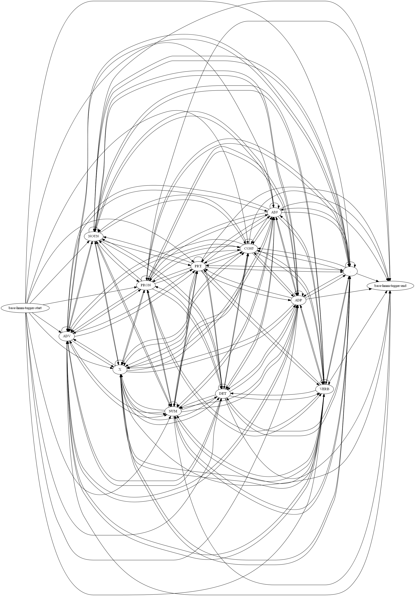

# Udacity Natural Language Processing Nanodegree

## Part of Speech Tagging



This project uses the [Pomegranate](https://github.com/jmschrei/pomegranate) library to build a hidden Markov model for part of speech tagging with a [universal tagset](https://www.petrovi.de/data/universal.pdf). Hidden Markov models have been able to achieve over 96% tag accuracy with larger tagsets on realistic text corpora. Hidden Markov models have also been used for speech recognition and speech generation, machine translation, gene recognition for bioinformatics, and human gesture recognition for computer vision, and more.

### Requirements

1. Download and install [Git](https://git-scm.com)
2. Download and install [Anaconda](https://www.anaconda.com)

### Set-up

Clone the project repository
```
git clone https://github.com/sdonatti/nd892-project-hmm-tagger
```

Install required Python packages
```
cd nd892-project-hmm-tagger
conda env create -f environment.yaml
conda activate nd892-project-hmm-tagger
```

Launch the project Jupyter Notebooks
```
jupyter notebook
```

### License

This project is licensed under [Copyright (c) 2018 Udacity, Inc.](LICENSE)